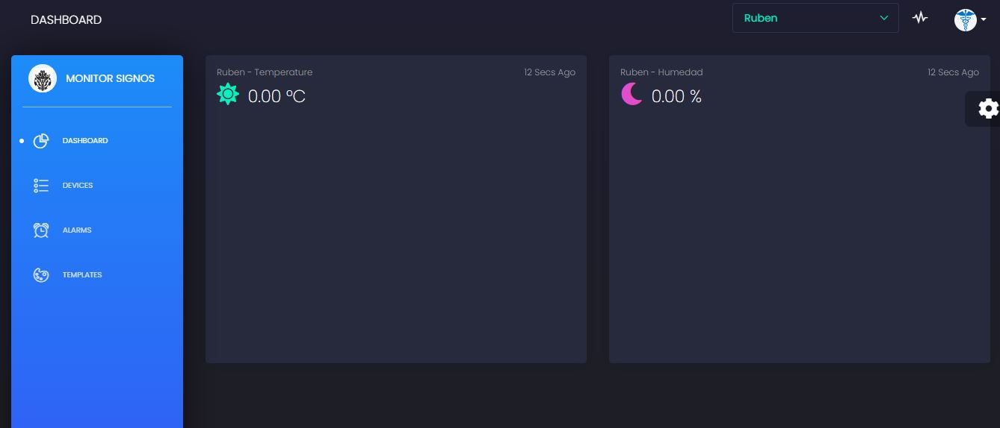
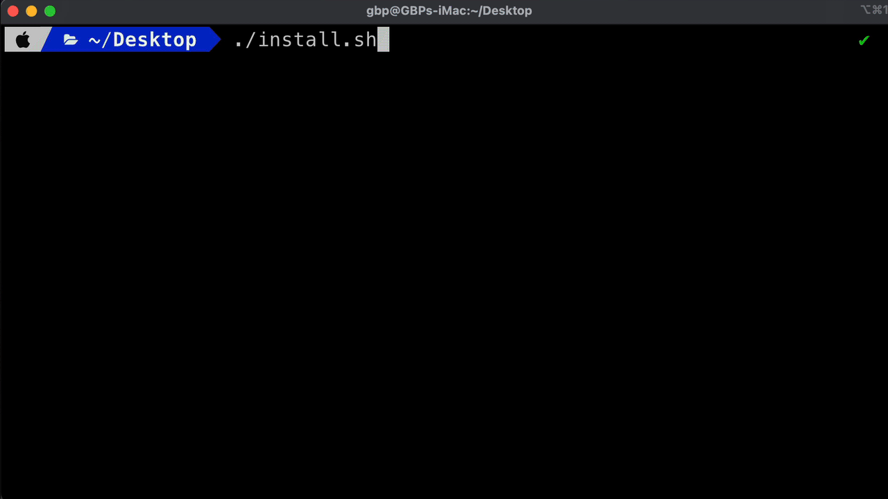

<h1 style="color:red">🔨🧱 Instalador de la Plataforma Vital Signs 💻</h1>

Este repositorio contiene un script bash, el cual sera utilizado para instalar la <b style = "color:green">Plataforma Vital Signs</b> para sistemas linux(Ubuntu).

<!-- <b style = "color:green"></b> -->
<!-- <h1 style="color:"></h1> -->
<h2 style="color:orange">Instalador:</h2>



Podemos encontrar el intalador (script bash) en el sig enlace:

https://github.com/RubenD-hub/Vital_Signs-Plataform/blob/main/Install_Plataform.sh



<h3 style="color:orange">Pasos de creacion del Instalador</h3>
 
Copia el contenido del archivo <b style = "color:green">install_Monitor.sh</b>
1. En el servidor linux (Ubuntu LTS recomendado) crearemos un archivo llamado <b style = "color:green">install_Monitor.sh</b> con el comando:

```bash
sudo nano install.sh
```

2. Tienes que optener la copia del contenido del archivo <b style = "color:green">install_Monitor.sh</b> que se encuentra en este repositorio.

3. Una vez en el editor nano pegamos el contenido que habíamos copiado.

4. Grabamos con ctrl + X luego presionar "enter" luego presionar "Y".

5. Ahora ejecutaremos el siguiente comando para darle permisos totales al archivo recientemente creado.

```bash
sudo chmod 777 install.sh
```

<h2 style="color:orange">Ejecución:</h2>
Ahora sí, momento de ejecutar nuestro instalador. (El mismo obtendra tanto los servicios como la app.

<h3 style="color:orange">Pasos de instalación:</h3>

1. Ejecutar el instalador

```bash
sudo ./install.sh
```

2. Responder el cuestionario para efectuar la instalación.

<h2 style="color:orange">Notas:</h2>

- Luego de ejecutar el instalador la plataforma quedará corriendo en su totalidad.

- Como verán en el repositorio tenemos tres archivos docker-compose importantes.

  - docker_node_install.yml:

    Este compose, lo ejecutaremos cuando a futuro necesitemos instalar dependencias nuevas vía npm.

  - docker_nuxt_build.yml:

    Este compose, lo ejecutaremos cuando por ejemplo, modificamos el código de nuestro repositorio (algo en el front po ejemplo) y necesitemos llevar estos cambios a producción.
    Al ejecutar este compose, estaremos haciendo un "build" con nuxt. Lo que recompilara tanto código front como el de nuestra api.

  - docker_compose_production.yml:

    Este último es el que lanza a producción nuestra plataforma. Y es el único que deberíamos correr con el "-d" al final de comando para que quede corriendo como servicio.

- En los 2 casos anteriores, se recomienda hacerlo sin el -d para observar la salida.

- En los 2 casos anteriores, (install y build), una vez que se ejecutan y terminan su tarea, los mismos finalizan con un exit. (no quedan corriendo) Lo que es normal.

- El motivo por el cual separamos install - build - production en tres contenedores, (siendo que se podría hacer todo junto) es para evitar saturar procesador y memoria servidores pequeños.
